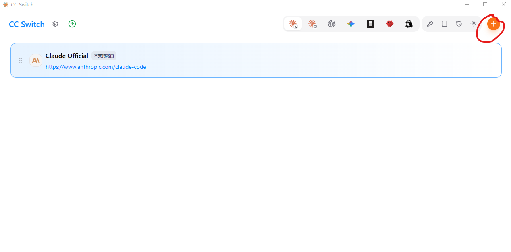
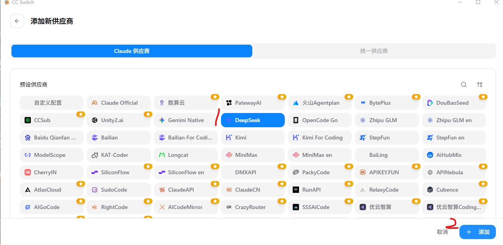
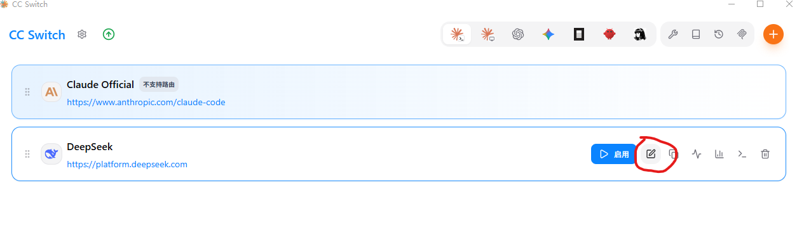
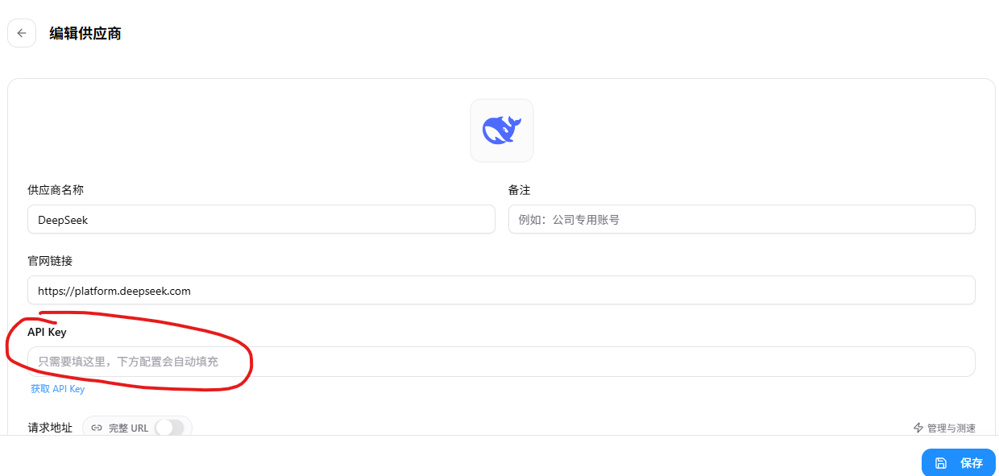
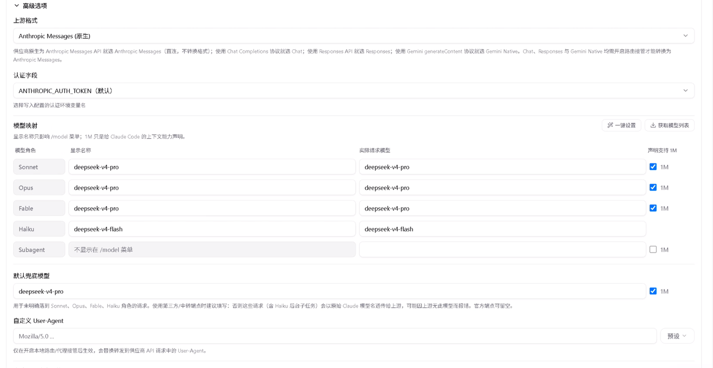
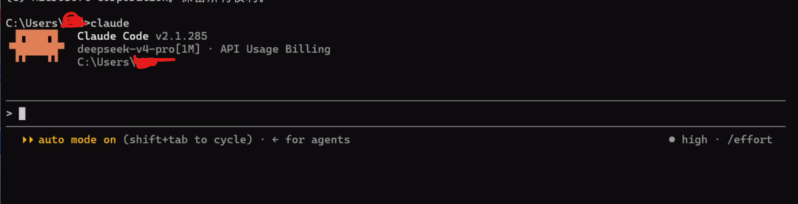

# ClaudeCode安装

## 1.前置条件

  安装前需要 安装Git和Node.js(ClaudeCode安装时使用)

## 2.具体安装ClaudeCode

1：WIndows系统：在Powershell中输入：npm install -g @anthropic-ai/claude-code

等待运行完成就安装结束了。

如果报：npm : 无法加载文件 D:\Program Files\nodejs\npm.ps1，因为在此系统上禁止运行脚本。

先执行：Set-ExecutionPolicy -ExecutionPolicy RemoteSigned -Scope CurrentUser

再执行安装程序。

2：安装完成后输入：claude --version 如果返回：2.1.220 (Claude Code)或者其他版本说明安装成功

## 3.切换AI模型

直接使用claudeCode需要登录Anthropic 账号，需要切换AI源。

下载[CCswith](https://ccswitch.io/zh/)

然后安装，打开

1：添加模型

2:进入添加页面后，选择你的模型来源，这里采用的deepseek作为AI模型源

3:设置模型参数，打开设置，输入模型API，并设置模型参数

4：选择启用后，命令行运行ClaudeCode,可以看到模型采用deepseekV4模型

## VS2022使用

1：vscode2022打开**扩展**，选择**管理扩展**，在**浏览中**的搜索框输入**Claude Code Extension for Visual Studio **找到并选择**安装**该插件扩展，然后关闭vs2022自动安装插件。

需要注意扩展插件版本要和vs2022一致，如果插件太新，vs2022版本太旧会出现安装失败情况，需要升级vs2022,不想升级vs2022只能选择旧版本的插件。

安装完成后打开VS2022选择**视图**-**其他窗口**-**Claude Code Extension**

